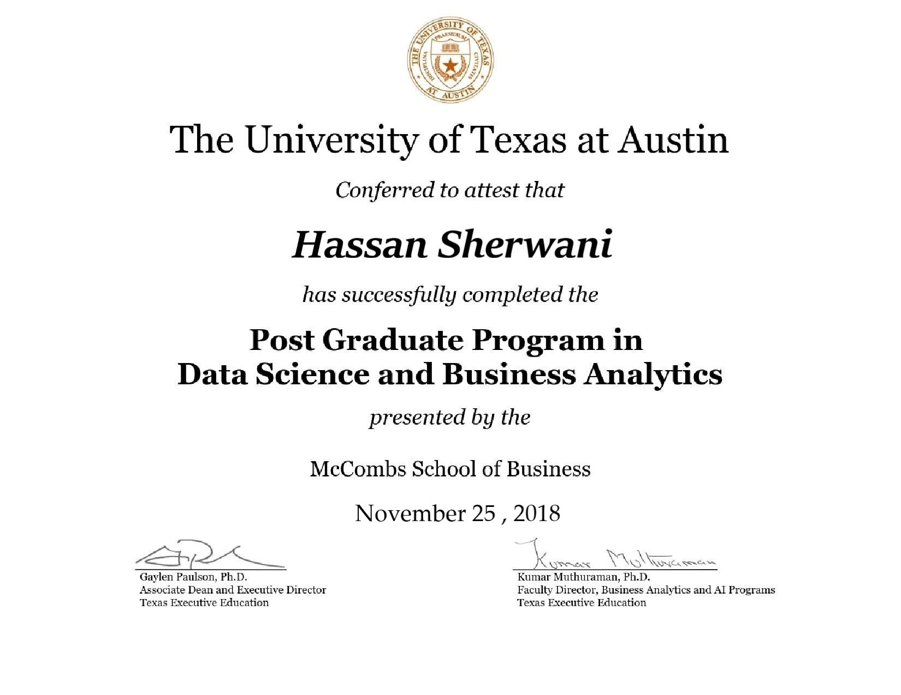

# Post graduate diploma in data science and business analytics

Online diploma taken at McCombs School of Business,University of Texas at Austin.

# Applied Projects

1- Acquisition Risk Analytics

2- Bank Marketing - Acquisition Analytics

3- Car Price Prediction

4- Gramener Case Study

5- HELP NGO funding analysis

6- House Price Prediction

7- Lead Scoring Case Study

8- MNIST Digit recognition

9- Movie Analysis

10- NYC Parking Tickets

11- Telecom Churn Case 

12- Uber Supply Demand Gap analysis

